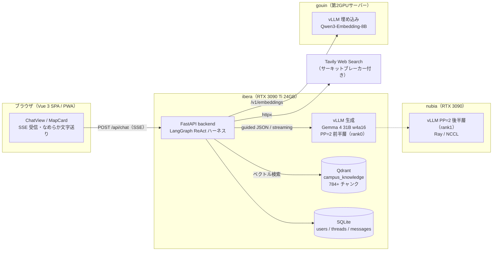

<div align="center">


# APU-Navi

**秋田県立大学 本荘キャンパスを案内する、フルローカル LLM の AI エージェント**

オープンキャンパス 2026 来場者（高校生・保護者）の「知りたい」に、
学内ナレッジ RAG × Web 検索 × 経路案内で答えるキャンパスガイド。

[](frontend/)
[](backend/)
[](docs/AGENT_REACT.md)
[](docs/PP2_MULTINODE_GUIDE.md)
[](docs/ARCHITECTURE.md)
[](knowledge/)
[](frontend/public/manifest.json)

**本番:** https://ibera.cps.akita-pu.ac.jp

</div>

---

## ✨ これは何？

**APU-Navi** は、秋田県立大学 本荘キャンパスの学部・学科、研究室、施設、アクセス、
オープンキャンパス当日のイベントについて自然言語で質問できる AI エージェントです。

クラウド LLM API は一切使いません。**生成も埋め込みも研究室の GPU 3 台で完結**します —
Gemma 4 31B を 2 筐体パイプライン並列（PP=2）でサービングし、
学内ナレッジ 130 文書・784+ チャンクを Qdrant でベクトル検索、
足りない情報だけ Tavily で Web 検索します。

## 🚀 主な機能

- 🧠 **Agentic RAG（ReAct ループ）** — LangGraph の decide ループが `retrieve` / `search` / `get_docs` / `web_search` / `campus_navigator` / `ask_user` / `finish` を毎ターン自律選択。停止条件は周回数ではなくコンテキスト予算
- 💭 **思考のライブ実況** — 「学内ナレッジを検索しています…」だけでなく、エージェントが**いま生成中の思考そのもの**を SSE でストリーミング表示（guided JSON のストリーミングデコード）
- 🗺️ **経路案内マップカード** — 「受付から学部棟Ⅰまで行きたい」で自作ベクターマップに経路を描画。出発地不明ならマップタップで現在地を申告、全画面ビューア（pinch / ダブルタップ）付き
- ✍️ **なめらか文字送り** — トークン到着をクライアント側でペーシングし、ChatGPT/Gemini 級の読み心地に
- ❓ **確認質問フォーム** — エージェントが逆質問（`ask_user`）したターンは専用回答フォーム＋composer ロックの elicitation UI に切り替え
- 🌌 **Gemini 実スクショ準拠のアンビエント UI** — ログイン=白×パステルブルーの霧、チャット=黒×深インディゴのグロー。待機中は「雲が流れる」思考中モーション
- 📱 **PWA** — ホーム画面に追加してアプリとして起動。スマホ縦画面の利用が主戦場
- 🧵 **会話スレッド永続化** — ニックネーム登録だけの軽量ログインで、履歴・名前変更・削除に対応（SQLite）
- 🛡️ **フェイルセーフ** — Tavily 枠超過時はサーキットブレーカーが作動し、学内ナレッジのみで回答継続
- 🥚 **隠し機能** — 合言葉を知っている人だけが出会える"なにか"がいます

## 🏗️ アーキテクチャ



1 つの質問に対しエージェントは `status`（思考実況）→ `token`（回答本文）→ `map`（経路カード）→
`done`（出典・確認質問フラグ）の SSE イベントを流します。スキーマの正は
[`docs/ARCHITECTURE.md`](docs/ARCHITECTURE.md) §3、ワークフロー全体図は
[`docs/AGENT_ARCHITECTURE.md`](docs/AGENT_ARCHITECTURE.md)。

### 技術スタック

| レイヤ | 選定 |
|---|---|
| フロントエンド | Vue 3 + Vite + Tailwind CSS + Pinia + marked |
| バックエンド | Python 3.11 / FastAPI / SSE |
| エージェント制御 | LangGraph 1.2.9（StateGraph 定義＝実行・ReAct ハーネス v6） |
| 生成 LLM | `google/gemma-4-31B-it-qat-w4a16-ct` — vLLM PP=2（ibera + nubia、16k 窓）。切り戻し先: 12B 単機 |
| 埋め込み | `Qwen/Qwen3-Embedding-8B` — 別 GPU サーバーで vLLM serve（OpenAI 互換 `/v1/embeddings`） |
| ベクトル DB | Qdrant |
| Web 検索 | Tavily API（`SearchProvider` で抽象化） |
| 永続化 | SQLite（1 日イベント規模に最適化） |

## ⚡ クイックスタート（Docker Compose）

前提: NVIDIA GPU + Docker（`--gpus` 対応）、埋め込みサーバー（`EMBEDDING_BASE_URL`）への疎通。
単機で動かす場合は compose 同梱の **Gemma 4 12B** を使います（`LLM_MODEL` を 12B に上書き）。

```bash
docker compose up -d qdrant vllm
python -m pip install -r backend/requirements.txt
python knowledge/ingest/ingest.py --recreate          # ナレッジ投入（130 文書 → 784+ チャンク）
LLM_MODEL=google/gemma-4-12B-it-qat-w4a16-ct docker compose up -d backend
docker compose up -d frontend
```

| サービス | URL |
|---|---|
| Frontend | http://localhost:5173 |
| Backend health | http://localhost:8080/api/health |
| vLLM（生成） | http://localhost:8000/v1 |
| Qdrant | http://localhost:6333 |

> **本番構成（31B PP=2）**: nubia の worker → ibera の head → `serve-31b.sh` の順で
> 2 筐体サービングを立ててから `docker compose up -d backend`（compose の vllm サービスは起動しない）。
> 構築原理と runbook は [`docs/PP2_MULTINODE_GUIDE.md`](docs/PP2_MULTINODE_GUIDE.md) / [`infra/pp2/`](infra/pp2/)。

## 🛠️ ローカル開発

### Backend

```bash
cd backend
python -m pip install -r requirements.txt
AGENT_MODE=mock uvicorn app.main:app --reload --host 127.0.0.1 --port 8080
```

`AGENT_MODE=mock` なら GPU なしで起動できます。実エージェントを使う場合はリポジトリルートで
vLLM と Qdrant を立ち上げ、ナレッジを投入してから起動します。

```bash
docker compose up -d qdrant vllm
python knowledge/ingest/ingest.py --recreate
cd backend
uvicorn app.main:app --reload --host 127.0.0.1 --port 8080
```

SQLite は既定で `backend/data/campus-guide.sqlite3` に作成されます。設定は `.env.example` を参照。

### Frontend

```bash
cd frontend
npm install
npm run dev
```

Vite dev server は `/api` を `http://127.0.0.1:8080` にプロキシします
（`VITE_API_PROXY_TARGET` で上書き可）。

### テスト

```bash
pytest                        # backend（リポジトリルートで）
cd frontend && npm run test   # frontend（Vitest）
cd frontend && npm run build  # ビルド検証
```

## 📁 リポジトリ構成

```
oc_2026/
├── frontend/          # Vue 3 SPA（チャット UI・マップカード・ローディング演出・PWA）
├── backend/           # FastAPI（認証・スレッド・SSE チャット・ReAct エージェント）
│   └── app/agent/     # LangGraph ハーネス・キャンパス経路グラフ・navigator サブエージェント
├── knowledge/         # RAG ナレッジ 130 文書（学部・施設・アクセス・OC2026 イベント…）
│   └── ingest/        # Qdrant インジェストスクリプト
├── infra/pp2/         # Gemma 4 31B の 2 筐体 PP=2 サービング一式（Ray / serve-31b.sh）
├── deploy/            # 本番デプロイ関連
└── docs/              # 全仕様書（ドキュメントが常に正）
```

## 📚 ドキュメント

| ドキュメント | 内容 |
|---|---|
| [`docs/SPEC.md`](docs/SPEC.md) | システム仕様書（FR-1〜FR-41 の全機能要件と改訂履歴） |
| [`docs/ARCHITECTURE.md`](docs/ARCHITECTURE.md) | 技術選定・API / SSE イベントスキーマ・本番公開構成 |
| [`docs/AGENT_ARCHITECTURE.md`](docs/AGENT_ARCHITECTURE.md) | エージェント全体のワークフロー図（mermaid） |
| [`docs/AGENT_REACT.md`](docs/AGENT_REACT.md) | ReAct ハーネス v6 の仕様（decide ループ・ツール契約） |
| [`docs/PP2_MULTINODE_GUIDE.md`](docs/PP2_MULTINODE_GUIDE.md) | 31B 2 筐体パイプライン並列の原理・構築・切り戻し runbook |
| [`docs/MAP_CARD.md`](docs/MAP_CARD.md) | 経路案内マップカード（route / place / ask_origin） |
| [`docs/UI_LOADING_ANIMATION.md`](docs/UI_LOADING_ANIMATION.md) | ローディング演出 Ver1.0 → Ver5.0 |
| [`docs/KNOWLEDGE.md`](docs/KNOWLEDGE.md) | RAG ナレッジ構築計画（収集源・検証ルール） |

## 🤖 開発体制 — AI ペアによるドキュメント駆動開発

このリポジトリは **2 つの AI エージェントの分業**で開発されています。

| 役割 | 担当 |
|---|---|
| 仕様の決定・アーキテクチャ判断・コードレビュー | **Fable**（Claude Code） |
| 実装・サーベイ・ナレッジ収集 | **Codex** |

Fable が仕様を `docs/` に落とし、Codex が実装し、Fable が検収する。
仕様の不明点は [`docs/QUESTIONS.md`](docs/QUESTIONS.md) で裁定を仰ぎ、
**ドキュメントを常に正**として運用します。詳細は [`CLAUDE.md`](CLAUDE.md) / [`AGENTS.md`](AGENTS.md)。

ブランチ運用: `main`（リリース）← `develop`（統合）← `feature/*`（作業）。PR は `develop` 向け。

---

<div align="center">

秋田県立大学 サイバーフィジカルシステム研究室（CPS Lab）
開発: 高橋 潤大 ／ Powered by **Gemma 4** — すべての推論は学内 GPU で

</div>
