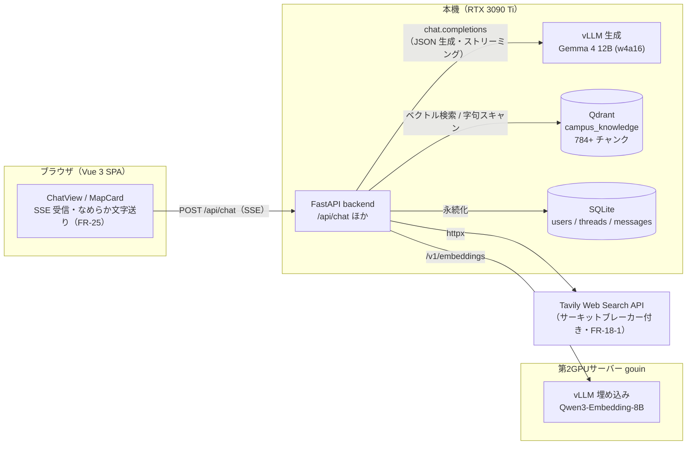
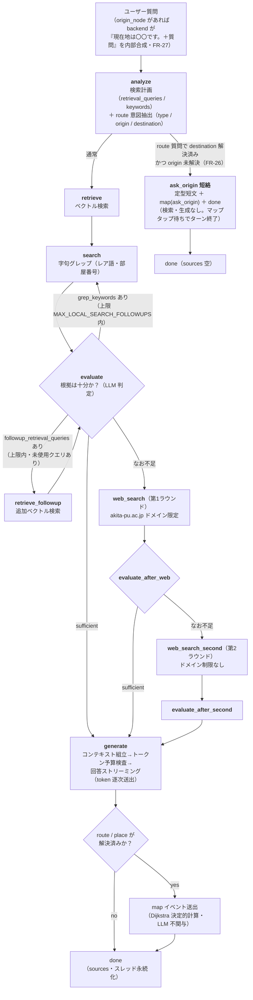
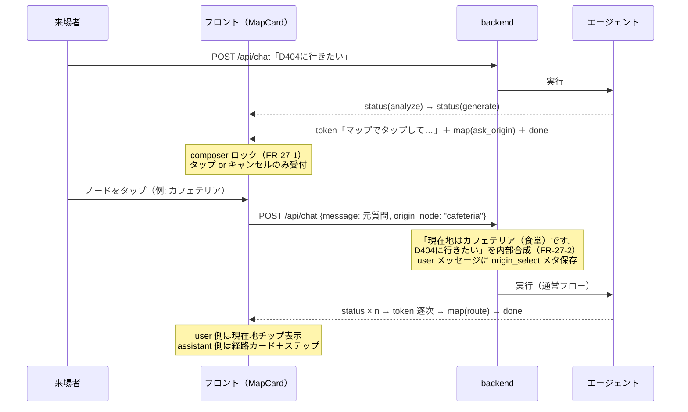

# エージェント全体アーキテクチャ（ワークフローとツール）

- 版: v1.0（2026-07-17, Fable 起草 — 利用者指示 FR-27-4）
- 目的: AI エージェント（`backend/app/agent/graph.py` の `RealCampusAgent`）の**ワークフロー全体**と
  **各ノードで使用可能なツール**を一望できるようにする。
- 実装詳細（プロンプト全文・定数・検収履歴）は `docs/AGENT_HARNESS.md` が正。
  SSE イベントスキーマは `docs/ARCHITECTURE.md` §3。**graph.py の構造を変える変更は本文書の更新を伴うこと**。

## 1. システム全体の配置

## 2. エージェントワークフロー（LangGraph）

1 リクエスト = 1 実行。ステップ遷移のたびに SSE `status` を送出する（FR-2）。
FR-26 の ask_origin 短絡だけは LangGraph に入る前にターンを終える。

- Tavily がクォータ超過等（401/403/429/432/433）のとき、Web 2 ラウンドはスキップされ
  ナレッジのみで generate へ進む（FR-18-1 サーキットブレーカー）。
- generate はトークン予算超過時に縮小コンテキストで 1 回だけ再構築・リトライする。

## 3. 各ノードの役割と使用ツール

| ノード | 役割 | 使用ツール / 外部リソース | LLM |
|---|---|---|---|
| analyze | 検索計画（クエリ 2〜3 本・keywords ≤6 語）と route 意図（type/origin/destination）の JSON 抽出。直近 4 ターン履歴（FR-18-5）を参照 | 生成 vLLM（JSON 応答）、campus_map リゾルバ（`resolve_location`: NFKC 正規化辞書引き — LLM 不使用） | ✔ |
| ask_origin 短絡 | 出発地不明の経路質問でターンを終端し、マップタップカードを提示（FR-26） | campus_map（`ask_origin_map_payload`）。検索・生成は実行しない | — |
| retrieve / retrieve_followup | 意味ベクトル検索。followup は evaluate が提案した未使用クエリのみ実行 | 埋め込み vLLM（Qwen3-Embedding-8B・gouin）＋ Qdrant 類似検索 | — |
| search | レアトークン（部屋番号 GI512 等・固有名詞）の決定的字句グレップ。表記ゆれはバリアント展開 | Qdrant スキャン＋コード内正規化（`app/rag/lexical.py`）。LLM・埋め込み不使用 | — |
| evaluate（3 種） | 集めた根拠の充足判定と不足時の追加手段提案（grep_keywords / followup_retrieval_queries / web_queries） | 生成 vLLM（JSON 応答） | ✔ |
| web_search（第1） | 公式サイト限定の Web 検索と本文取得 | Tavily API（`include_domains: akita-pu.ac.jp`、raw_content、サーキットブレーカー） | — |
| web_search_second（第2） | ドメイン制限なしの追加 Web 検索 | Tavily API（制限なし） | — |
| generate | 根拠を組み立てて回答を生成・ストリーミング。出典 dedupe。履歴由来の出発地は冒頭で明示（FR-26 §7-4） | 生成 vLLM（ストリーミング）。トークン予算検査・縮小リトライはコード | ✔ |
| map 送出（generate 後） | 経路/場所カードのペイロード計算 | campus_map（Dijkstra・並行エッジの階選択・ステップ文テンプレート — **LLM に空間推論をさせない**、FR-11/26 原則） | — |

## 4. FR-26/27 マップタップの会話フロー（ターン境界）

mid-run interrupt は不採用（裁定: `docs/MAP_CARD.md` §2-1）。エリシテーションはターン終端で行う。

## 5. SSE イベント（要約）

`status`（各ステップ開始時・FR-2）→ `token`（回答本文の逐次配信・FR-3/25）→
`map`（route / place / ask_origin。token 完了後・done 直前に最大 1 回・FR-26）→
`done`（thread_id / message_id / sources）。エラー時は `error`。
詳細スキーマは `docs/ARCHITECTURE.md` §3。
