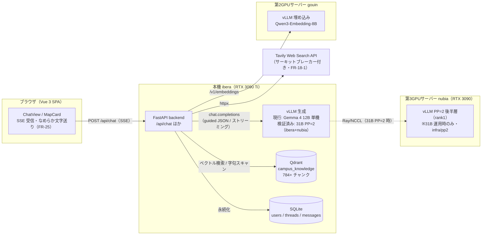
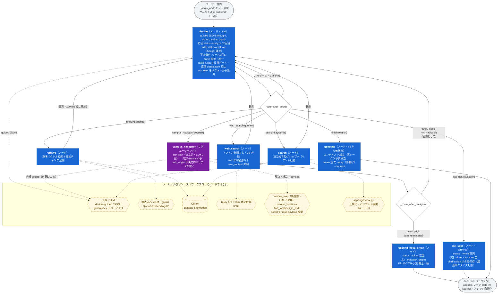
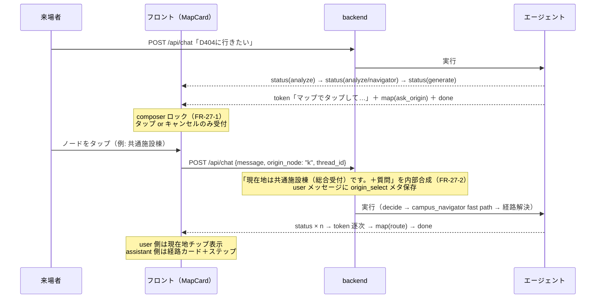

# エージェント全体アーキテクチャ（ReAct ワークフローとツール）

- 版: v2.0（2026-07-18, Fable — **FR-34 ReAct ハーネス v6 を反映して全面改稿**。
  固定フロー（analyze→retrieve→search→evaluate→web_search）を **decide ループ＋ツール**へ刷新、
  経路ドメインを campus_navigator サブエージェントへ切り出し。仕様と裁定の正は
  `docs/AGENT_REACT.md` v1.0。旧 v1.2（FR-33 時点の固定フロー図）はコミット ecdae04 時点を参照）
  - v1.2（2026-07-18, FR-33 定義＝実行一本化）/ v1.1・v1.0（2026-07-17）
- 目的: AI エージェント（`backend/app/agent/graph.py` の `RealCampusAgent`）の**ワークフロー全体**と
  **各ノードで使用可能なツール**を一望できるようにする。
- 実装詳細（プロンプト全文・定数・検収履歴）は `docs/AGENT_HARNESS.md` が正。
  SSE イベントスキーマは `docs/ARCHITECTURE.md` §3。**graph.py の構造を変える変更は本文書の更新を伴うこと**。

## 1. システム全体の配置

- 生成 LLM は **モデル非依存の 1 論理エンドポイント**（`VLLM_BASE_URL`）。現行本番は 12B 単機、
  31B PP=2（16k 窓）は 2026-07-18 に PoC・実 LLM E2E とも合格済みで、切り替えは
  エンドポイント差し替えのみ（構築・原理: `docs/PP2_MULTINODE_GUIDE.md`、運用: `infra/pp2/README.md`）。

## 2. エージェントワークフロー（ReAct decide ループ・FR-34）

1 リクエスト = 1 実行。compile 済み `StateGraph` を `stream()` が
`astream(state, stream_mode=["updates","custom"], config={"recursion_limit": 50})` で実行する
（定義＝実行・FR-33 の原則は不変）。各ノードは SSE 形の custom イベント（status / token / map）を
`get_stream_writer()` で送出し、`stream()` は薄いアダプタとして転送・`updates` をマージ累積して
終端で `done` を 1 回送出する。

**v6 の本質**: どのツールをどの順で使うかを固定フローで決めず、**decide ノード（LLM・guided JSON）が
毎ターン選択**する。探索の停止もカウンタではなく**コンテキスト予算**で決める。

### 2-1. ワークフロー（定義＝実行の唯一の図）

凡例: **青 = ワークフローノード**／**紫 = サブエージェント**／**黄の六角・破線 = ツール（外部リソース・純関数）**／
**白ひし形 = conditional edge**／**灰角丸 = `stream()` アダプタ**。

### 2-2. 予算・停止条件（回数上限は存在しない）

- 主予算 = **decide プロンプトのコンテキスト使用量**（`/tokenize` 実カウント、失敗時は文字数推定）。
  実効窓（`VLLM_MAX_MODEL_LEN`、旧 `LLM_CONTEXT_WINDOW` フォールバック・デフォルト 16384）に対し
  - **soft（70%）**: decide へ「まとめに入れ」注記＋web_search の raw_content 取得を抑制
  - **hard（85%）または evidence が generate 実予算を充足**: メニューを `finish`（＋ask_user）へ縮退
- 安全弁（チューニングノブではない）: 同一 `(action, action_input)` 反復ガード・`recursion_limit 50`。
- decide transport 死亡時のフォールバック: ツール 0 回なら `retrieve(質問文)`、実行済みなら `finish`
  （ターンを落とさない）。

### 2-3. 例外耐性・trace

- ツール実行ノードの失敗はエラー観測として decide に返り degraded 続行（ターンを落とさない）。
- `agent.trace` に decide の thought / action / action_input / 予算状態、navigator の fast_path 成否・
  内部軌跡、generate の採用チャンクを JSON Lines で記録（`AGENT_TRACE=0` で無効化）。

## 3. 各ステップの区分・役割・使用ツール

| 区分 | ステップ | 役割 | 使用ツール / 外部リソース | LLM |
|---|---|---|---|---|
| ノード | decide（`_decide`） | 次アクションの選択（guided JSON）。予算計測・メニュー構成・バリデーション（0回finish 差し戻し・反復ガード）・SSE 実況（初回 analyze / 以降 evaluate=thought）を担う | 生成 vLLM（`decide()`: response_format json_schema）、`/tokenize` | ✔ |
| ノード | retrieve（`_retrieve`） | 意味ベクトル検索（queries 1..3）。ヒットを evidence store（`knowledge_results`）へマージ・兄弟チャンク展開。観測はタイトル＋抜粋を 120 tok 級に圧縮 | 埋め込み vLLM（gouin）＋ Qdrant | — |
| ノード | search（`_search`） | 決定的字句グレップ（keywords 1..6）。部屋番号・固有名詞向け。表記ゆれバリアント展開 | Qdrant スキャン＋ `app/rag/lexical.py` | — |
| ノード | web_search（`_web_search`） | Tavily 検索＋本文取得（queries 1..3）。**ドメイン制限なし**。CB 開放時は「利用不可」観測。soft 超過時 raw_content 抑制 | Tavily API＋httpx | — |
| サブエージェント | campus_navigator（`_campus_navigator` → `navigator.py`） | 学内の場所・経路解決。fast path（`find_locations_in_text`＋`resolve_location`・LLM 0回）→ 失敗時のみ内部 decide（resolve_place / find_route / ask_origin・≤3手）。戻りは route / place / need_origin / not_navigable の構造化 4 種。**最終文章は書かない** | campus_map（純関数）、生成 vLLM（内部 decide 時のみ） | （✔） |
| ノード | respond_need_origin（`_respond_need_origin`） | need_origin のターン終端。status→token[定型文]→map(ask_origin)。sources は位置インデックス出典（FR-29）。`turn_terminated` フラグの条件エッジで generate を構造的に迂回 | campus_map（payload は navigator が構築済み） | — |
| ノード | ask_user（`_ask_user`） | 自由文の聞き返しでターン終端（terminal）。token は 8 文字刻みで FR-25 文字送り互換。sources 空。clarification メタ保存 → 次ターンで ask_user をメニューから除外＋履歴に「（確認質問）」プレフィックス | — | — |
| ノード | generate（`_generate`・v5 から無改修） | コンテキスト組立・出典 dedupe → 実トークン予算検査（超過時縮小再構築）→ token 逐次 → map_payload があれば map 送出（token 完了後・done 直前）。履歴由来出発地の冒頭明示（FR-26 §7-4） | 生成 vLLM（ストリーミング）、campus_map | ✔ |
| アダプタ | done 送出（`stream()` 終端） | マージ state の sources で `done` を 1 回送出。ask_user の clarification メタを API 層へ受け渡し | — | — |

## 4. FR-26/27 マップタップの会話フロー（ターン境界）

mid-run interrupt は不採用（裁定: `docs/MAP_CARD.md` §2-1）。エリシテーションはターン終端で行う。
v6 では ask_origin の判断が campus_navigator 内へ移ったが、**ワイヤ上の契約は v5 と完全一致**
（実 LLM E2E で確認済み・2026-07-18）。

## 5. SSE イベント（要約）

`status`（step 語彙 `{analyze, retrieve, search, web_search, evaluate, generate}` は v5 と不変。
系列は ReAct 化により可変・evaluate の text は decide の thought 由来の実況。FR-36 で `partial`
フィールドを追加し、decide / navigator の思考中は生成途中の thought を partial:true で逐次配信 —
`docs/AGENT_STATUS_STREAMING.md`）→
`token`（回答本文の逐次配信・FR-3/25）→
`map`（route / place / ask_origin。token 完了後・done 直前に最大 1 回・FR-26）→
`done`（thread_id / message_id / sources）。エラー時は `error`。
詳細スキーマは `docs/ARCHITECTURE.md` §3。フロントは系列に依存せず step ごとの text を表示するのみ。
