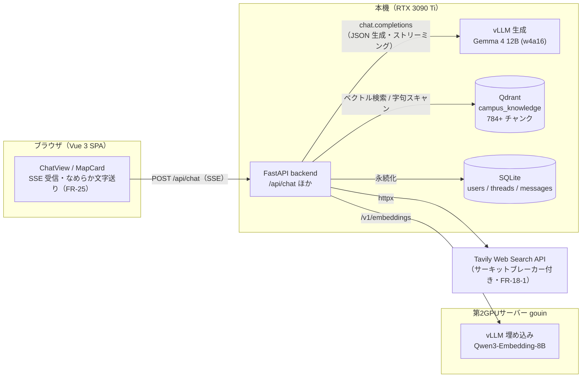
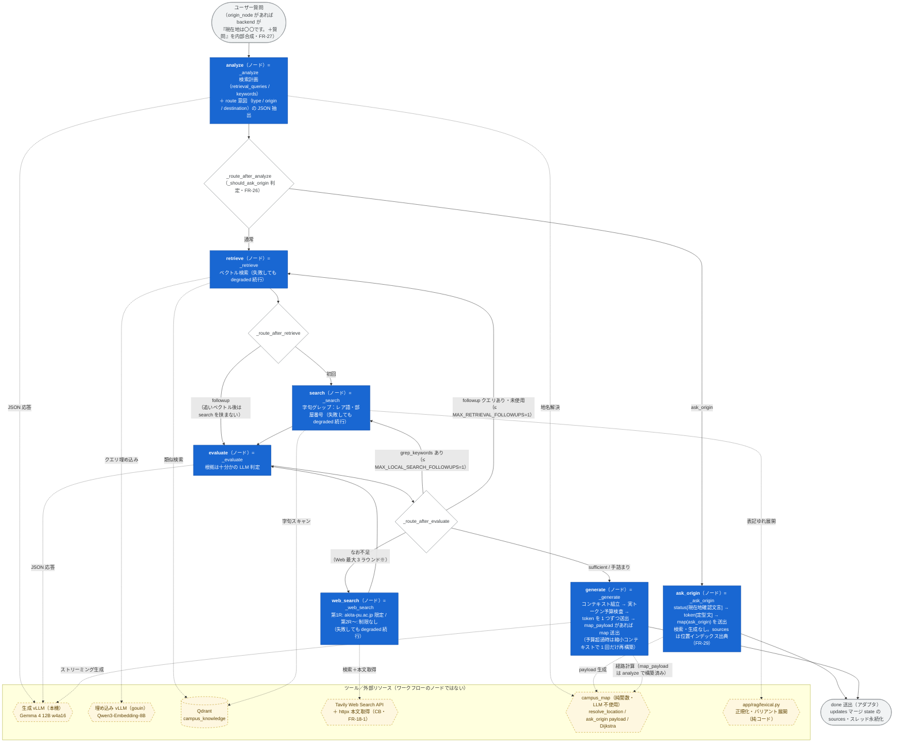
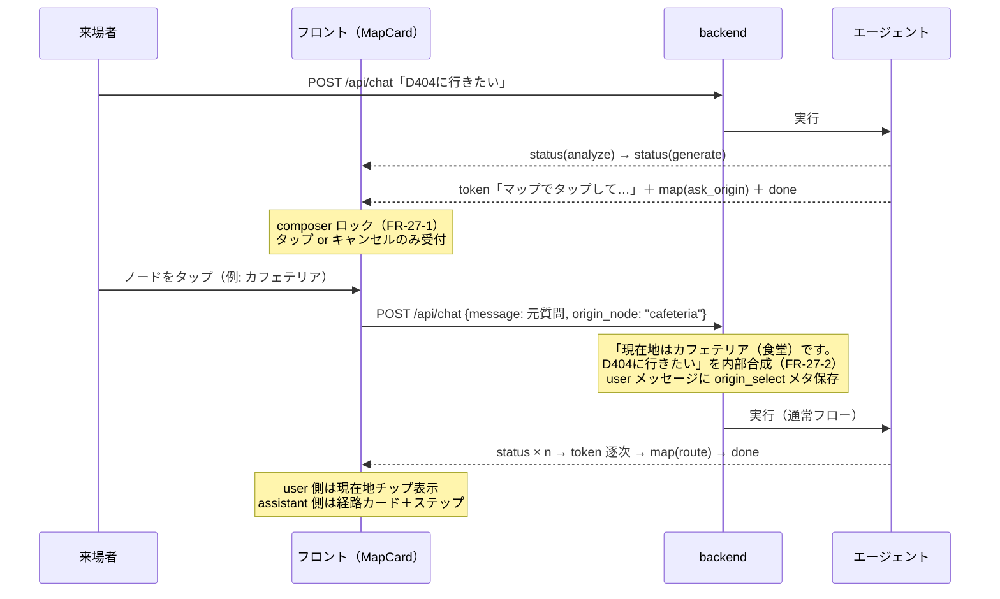

# エージェント全体アーキテクチャ（ワークフローとツール）

- 版: v1.2（2026-07-18, Fable — **FR-33 LangGraph 実行一本化を反映**。§2 を「定義＝実行」の
  単一図へ改稿し、旧 §2-2「定義の写し」・§2-3「乖離表」を廃止。ask_origin の sources と
  followup retrieve の遷移を出荷済み挙動どおりに訂正）
  - v1.1（2026-07-17, Fable — ノード/ツール/グラフ外処理を図中で区別。LangGraph は「定義のみ」で
    実行は `stream()` の手動オーケストレーションである事実を明記）
  - v1.0（2026-07-17, Fable 起草 — 利用者指示 FR-27-4）
- 目的: AI エージェント（`backend/app/agent/graph.py` の `RealCampusAgent`）の**ワークフロー全体**と
  **各ノードで使用可能なツール**を一望できるようにする。
- 実装詳細（プロンプト全文・定数・検収履歴）は `docs/AGENT_HARNESS.md` が正。
  SSE イベントスキーマは `docs/ARCHITECTURE.md` §3。**graph.py の構造を変える変更は本文書の更新を伴うこと**。

## 1. システム全体の配置

## 2. エージェントワークフロー（LangGraph 定義＝実行・FR-33）

1 リクエスト = 1 実行。compile 済み `StateGraph` を `stream()` が
`astream(state, stream_mode=["updates","custom"], config={"recursion_limit": 50})` で実行する。
各ノードは SSE 形の custom イベント（status / token / map）を `get_stream_writer()` で送出し、
`stream()` は**薄いアダプタ**としてそれをそのまま転送、`updates` をマージ累積して
終端で `done` を 1 回送出する（`docs/ARCHITECTURE.md` §3 の SSE 契約は不変）。

### 2-0. 経緯（要約）

- ハーネス v2〜FR-32: `langgraph==0.0.69` の実行時不具合（Q-006、2 回目 evaluate 後の分岐で停止）
  により、実行は `stream()` の手動逐次制御・StateGraph 定義は宣言的ミラーとして併存していた
  （当時の詳細は本書 v1.1 §2-0〜2-3 = コミット 02c4265 時点を参照）。
- FR-33（2026-07-18, 利用者指示）: `langgraph==1.2.9` へ更新し**定義＝実行に一本化**
  （PoC・裁定・受け入れ基準: `docs/LANGGRAPH_MIGRATION.md`、Q-006 追補）。
  エイリアスノード（retrieve_followup / evaluate_after_web / web_search_second /
  evaluate_after_second）と `_next_step_after` は廃止。
- **graph.py の構造を変えるときは本節の図・§3 の表・`docs/LANGGRAPH_MIGRATION.md` を更新すること。**

### 2-1. ワークフロー（定義＝実行の唯一の図）

凡例:
**青の四角 = ワークフローノード**（`add_node` 名 = 実体メソッド。writer で SSE イベントを送出）／
**黄の六角・破線枠 = ツール**（ノードから呼ばれる外部リソース・純関数。ノードではない）／
**白のひし形 = conditional edge の判定関数**／
**灰の角丸 = `stream()` アダプタの処理**（グラフ外は質問合成と done 送出のみ）。

- ※ Web ラウンド: 2 ラウンドまでは無条件に許可、第 3 ラウンドは未解決キーワードが残る場合のみ
  （`MIN_WEB_ROUNDS_BEFORE_GIVE_UP=2` / `MAX_WEB_SEARCH_ROUNDS=3`）。第 1 ラウンドだけ
  `include_domains: akita-pu.ac.jp`、第 2 ラウンド以降は制限なし（ラウンド番号で自動切替）。
- Tavily がクォータ超過等（401/403/429/432/433）のときは Web ラウンド全体がスキップされ、
  ナレッジのみで generate へ進む（FR-18-1 サーキットブレーカー）。
- 例外耐性: retrieve / search / web_search は `_fault_tolerant_node` デコレータが失敗を握り、
  従来と同一の state パッチ・`logger.warning` で degraded 続行する。
- ノードを単体テストから直接呼ぶ場合、writer 不在（グラフ外実行）では SSE 送出は no-op になる
  （`_write_stream_event` が RuntimeError を吸収）。

## 3. 各ステップの区分・役割・使用ツール

「区分」列: **ノード** = LangGraph `add_node` に定義されたワークフローノード（FR-33 以降、実行も
このグラフ）／**アダプタ** = `stream()` の処理（グラフ外は質問合成と done 送出のみ）。
「使用ツール」列のものはすべてツール（外部リソース・純関数）であり、ワークフローのノードではない。

| 区分 | ステップ | 役割 | 使用ツール / 外部リソース | LLM |
|---|---|---|---|---|
| ノード | analyze（`_analyze`） | 検索計画（クエリ 2〜3 本・keywords ≤6 語）と route 意図（type/origin/destination）の JSON 抽出。直近 4 ターン履歴（FR-18-5）を参照。route/place 解決時は map_payload もここで構築 | 生成 vLLM（JSON 応答）、campus_map リゾルバ（`resolve_location`: NFKC 正規化辞書引き — LLM 不使用） | ✔ |
| ノード | ask_origin（`_ask_origin`） | 出発地不明の経路質問でターンを終端し、status[現在地確認文言]→token[定型文]→map(ask_origin) を送出（FR-26）。検索・生成なし。sources は位置インデックス出典（FR-29） | campus_map（`ask_origin_map_payload`） | — |
| ノード | retrieve（`_retrieve`。初回→search へ・followup→直接 evaluate へ） | 意味ベクトル検索。followup は evaluate が提案した未使用クエリのみ実行 | 埋め込み vLLM（Qwen3-Embedding-8B・gouin）＋ Qdrant 類似検索 | — |
| ノード | search（`_search`） | レアトークン（部屋番号 GI512 等・固有名詞）の決定的字句グレップ。表記ゆれはバリアント展開。grep 追いラウンドは evaluate の grep_keywords で再入 | Qdrant スキャン＋コード内正規化（`app/rag/lexical.py`）。LLM・埋め込み不使用 | — |
| ノード | evaluate（`_evaluate`） | 集めた根拠の充足判定と不足時の追加手段提案（grep_keywords / followup_retrieval_queries / web_queries）。Web 後の再評価も同一ノードへ循環 | 生成 vLLM（JSON 応答） | ✔ |
| ノード | web_search（`_web_search`） | Web 検索と本文取得。第 1 ラウンドのみ公式サイト限定、第 2 ラウンド以降は制限なし（ラウンド番号で自動切替・最大 3 周） | Tavily API（`include_domains: akita-pu.ac.jp`＝第 1 のみ、raw_content、サーキットブレーカー） | — |
| ノード | generate（`_generate` = 組立→検査→送出を内包） | コンテキスト組立・出典 dedupe → 実トークン数で予算検査（超過時は縮小再構築）→ 回答を生成し token を 1 つずつ送出（予算超過エラー時は縮小コンテキストで 1 回だけリトライ・リトライ後 sources を反映）→ map_payload があれば map 送出（token 完了後・done 直前の順序をノード内で構造保証）。履歴由来の出発地は冒頭で明示（FR-26 §7-4） | 生成 vLLM（ストリーミング）、campus_map（Dijkstra・並行エッジの階選択・ステップ文テンプレート — **LLM に空間推論をさせない**、FR-11/26 原則） | ✔ |
| アダプタ | done 送出（`stream()` 終端） | `updates` をマージ累積した state の sources で `done` を 1 回送出。スレッド永続化は API 層 | — | — |

## 4. FR-26/27 マップタップの会話フロー（ターン境界）

mid-run interrupt は不採用（裁定: `docs/MAP_CARD.md` §2-1）。エリシテーションはターン終端で行う。

## 5. SSE イベント（要約）

`status`（各ステップ開始時・FR-2）→ `token`（回答本文の逐次配信・FR-3/25）→
`map`（route / place / ask_origin。token 完了後・done 直前に最大 1 回・FR-26）→
`done`（thread_id / message_id / sources）。エラー時は `error`。
詳細スキーマは `docs/ARCHITECTURE.md` §3。
