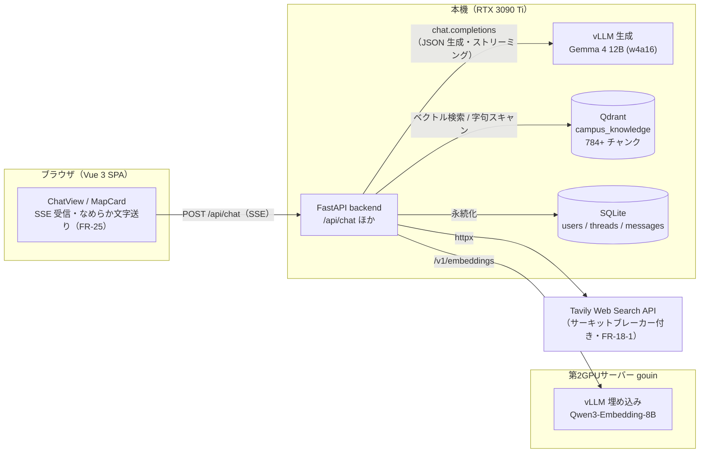
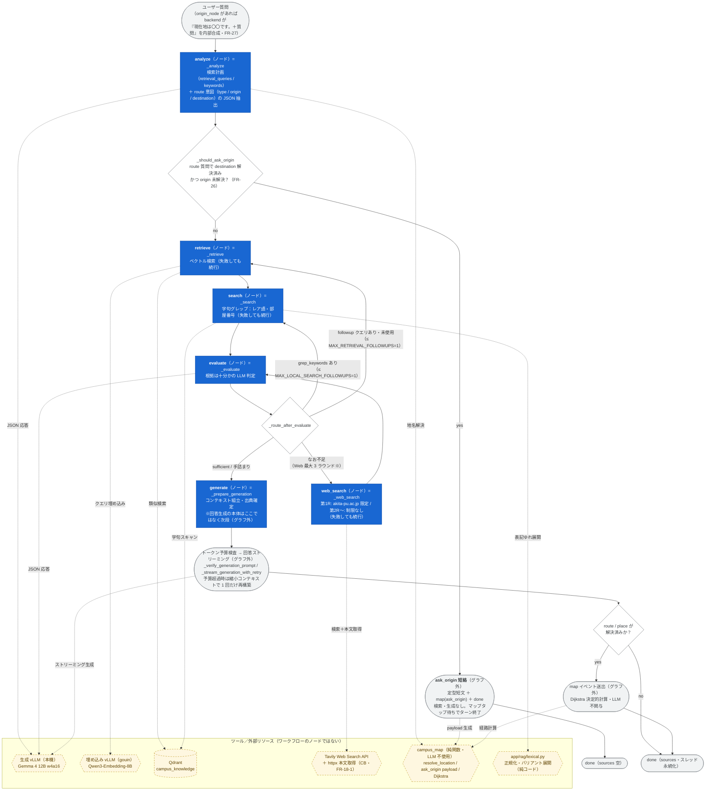
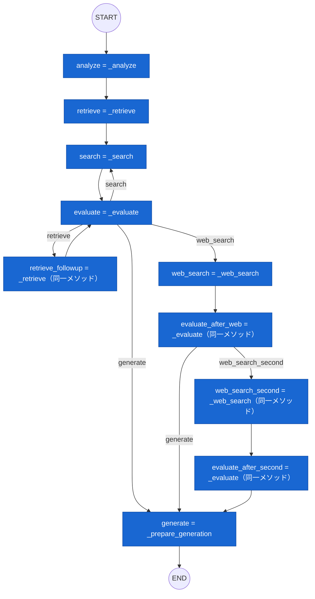
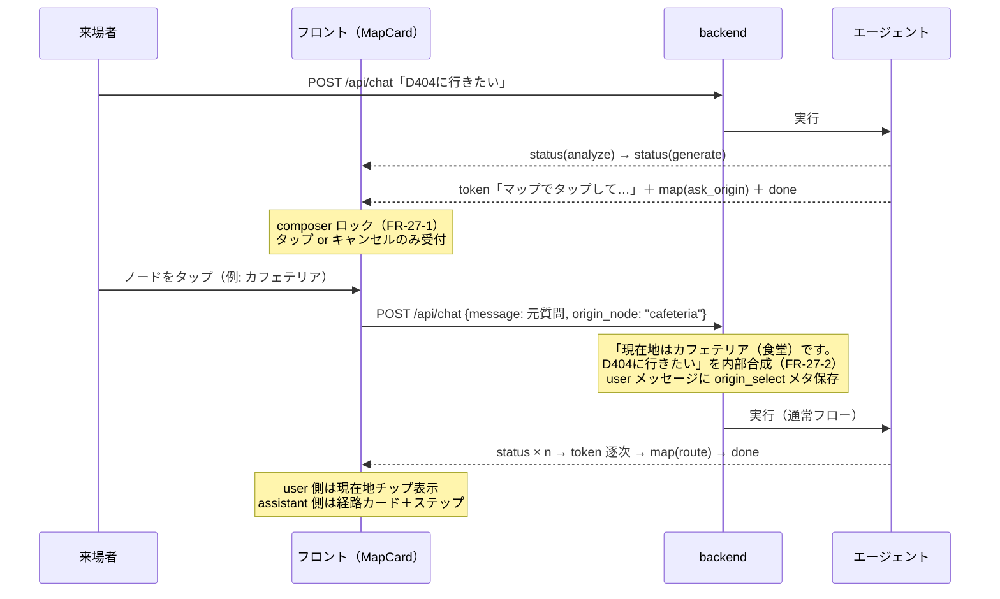

# エージェント全体アーキテクチャ（ワークフローとツール）

- 版: v1.1（2026-07-17, Fable — ノード/ツール/グラフ外処理を図中で区別。LangGraph は「定義のみ」で実行は `stream()` の手動オーケストレーションである事実を明記 §2-0〜2-3）
  - v1.0（2026-07-17, Fable 起草 — 利用者指示 FR-27-4）
- 目的: AI エージェント（`backend/app/agent/graph.py` の `RealCampusAgent`）の**ワークフロー全体**と
  **各ノードで使用可能なツール**を一望できるようにする。
- 実装詳細（プロンプト全文・定数・検収履歴）は `docs/AGENT_HARNESS.md` が正。
  SSE イベントスキーマは `docs/ARCHITECTURE.md` §3。**graph.py の構造を変える変更は本文書の更新を伴うこと**。

## 1. システム全体の配置

## 2. エージェントワークフロー

1 リクエスト = 1 実行。ステップ遷移のたびに `stream()` が SSE `status` を送出する（FR-2）。

### 2-0. LangGraph との関係（定義と実行は別物）

- ワークフローは LangGraph の `StateGraph` として**定義されている**（`_build_graph()`
  graph.py:400-439、`langgraph==0.0.69`。10 ノード＋条件エッジ 2 箇所を `compile()` まで行う）。
- ただし**コンパイル済みグラフは実行に使われていない**。`self._graph`（graph.py:240）への
  参照は代入の 1 箇所のみで、app / tests 全域で呼び出しゼロ（2026-07-17 調査）。
- 本番の実行パスは `stream()`（graph.py:242-394）の**手書きオーケストレーション**。
  グラフ定義と**同じノードメソッド・同じ分岐関数 `_route_after_evaluate` を直接呼ぶ**ため、
  遷移構造はほぼ一致する（意図的な乖離は §2-3 の表）。
- **直接の契機は `langgraph==0.0.69` の実行時不具合**（Q-006、2026-07-12 Fable 裁定）。
  初期実装（89dcf12）は実際に `self._graph.astream()` で実行していたが、ハーネス v2 の
  evaluate→web_search 2 周ループを循環／2 段目 conditional edge で表現すると
  **2 回目 evaluate 後の分岐で停止**したため、同じノードメソッドを `stream()` の
  逐次制御へ移した。裁定は「外部挙動（SSE・周回上限・分岐条件）が仕様どおりなら
  内部の制御方式は問わない。LangGraph のバージョン更新は任意課題」。
  v4 / v5 もこの裁定を継承（`docs/AGENT_HARNESS.md` V4 章・v5 章に明記）。
- 手書きが定着した構造的理由: ①ステップ境界ごとに SSE `status` を**開始前に**差し込む
  （FR-2。`astream(updates)` は完了通知のみのため、旧実装は次ステップ予測表
  `_next_step_after` の二重管理が必要だった — 現在は未使用のまま残存）
  ②retrieve / search / web_search の失敗を握って続行する段階別フォールトトレランス
  ③回答本文の token 逐次送出・map/done 送出はノードの外の処理だから
  ④周回ポリシーの進化（Web 2→3 ラウンド・ローカル追いラウンド・ask_origin 短絡）が
  定数と条件式の変更だけで済み、静的グラフの改形が不要だから。
- **graph.py の構造を変えるときは `_build_graph()`（定義）と `stream()`（実行）の両方を
  更新し、§2-1〜2-3 も直すこと。**

### 2-1. 実行フロー（`stream()` が実際に辿る流れ — こちらが正）

凡例:
**青の四角 = ワークフローノード**（LangGraph `add_node` 名 = 実体メソッド）／
**黄の六角・破線枠 = ツール**（ノードから呼ばれる外部リソース・純関数。ワークフローのノードではない）／
**灰の角丸 = `stream()` オーケストレータの処理**（グラフ外: SSE 送出・短絡・ストリーミング）／
**白のひし形 = 分岐判定**（LangGraph 定義では conditional edge の判定関数）。

- ※ Web ラウンド: 2 ラウンドまでは無条件に許可、第 3 ラウンドは未解決キーワードが残る場合のみ
  （`MIN_WEB_ROUNDS_BEFORE_GIVE_UP=2` / `MAX_WEB_SEARCH_ROUNDS=3`）。第 1 ラウンドだけ
  `include_domains: akita-pu.ac.jp`、第 2 ラウンド以降は制限なし（ラウンド番号で自動切替）。
- Tavily がクォータ超過等（401/403/429/432/433）のときは Web ラウンド全体がスキップされ、
  ナレッジのみで generate へ進む（FR-18-1 サーキットブレーカー）。

### 2-2. LangGraph StateGraph 定義（graph.py:400-439 の忠実な写し — compile 済みだが実行には未使用）

すべて青＝ワークフローノード（`add_node` 名 = 実体メソッド）。ツールはノード内から呼ばれる（§3 の表）。

条件エッジの判定関数: `evaluate` → `_route_after_evaluate`（graph.py:416-425）、
`evaluate_after_web` → `_route_after_first_web_evaluate`（graph.py:428-435）。

### 2-3. 定義と実行の乖離（graph.py 変更時はここも更新）

| 項目 | LangGraph 定義（`_build_graph`） | 実行（`stream()` — こちらが正） |
|---|---|---|
| 実行主体 | `compile()` 済みだが未使用（`self._graph` 参照ゼロ） | `stream()` がノードメソッドを直接呼ぶ |
| ask_origin 短絡 | 存在しない | analyze 直後に判定してターン終端（FR-26） |
| Web ラウンド数 | 最大 2（web_search → web_search_second で終端） | 最大 3（第 3 は未解決キーワード残存時のみ） |
| Web 後の再評価 | evaluate_after_web（web 続行 or generate の 2 択） | 同一 evaluate に戻る（上限内なら字句/ベクトル追い検索にも分岐し得る） |
| 別名ノード | retrieve_followup / evaluate_after_* / web_search_second が別ノード | 同一メソッドの再入で表現（別名なし） |
| generate 以降 | `_prepare_generation` で END | 予算検査 → token 逐次送出 → map → done（グラフ外） |
| 例外耐性 | なし | retrieve / search / web_search の失敗を握って続行 |

## 3. 各ステップの区分・役割・使用ツール

「区分」列: **ノード** = LangGraph `add_node` に定義されたワークフローノード（実行時は `stream()` が直接呼ぶ）／
**グラフ外** = `stream()` オーケストレータの処理（StateGraph 定義に存在しない）。
「使用ツール」列のものはすべてツール（外部リソース・純関数）であり、ワークフローのノードではない。

| 区分 | ステップ | 役割 | 使用ツール / 外部リソース | LLM |
|---|---|---|---|---|
| ノード | analyze（`_analyze`） | 検索計画（クエリ 2〜3 本・keywords ≤6 語）と route 意図（type/origin/destination）の JSON 抽出。直近 4 ターン履歴（FR-18-5）を参照 | 生成 vLLM（JSON 応答）、campus_map リゾルバ（`resolve_location`: NFKC 正規化辞書引き — LLM 不使用） | ✔ |
| グラフ外 | ask_origin 短絡（`_should_ask_origin` 判定） | 出発地不明の経路質問でターンを終端し、マップタップカードを提示（FR-26） | campus_map（`ask_origin_map_payload`）。検索・生成は実行しない | — |
| ノード | retrieve / retrieve_followup（`_retrieve`） | 意味ベクトル検索。followup は evaluate が提案した未使用クエリのみ実行 | 埋め込み vLLM（Qwen3-Embedding-8B・gouin）＋ Qdrant 類似検索 | — |
| ノード | search（`_search`） | レアトークン（部屋番号 GI512 等・固有名詞）の決定的字句グレップ。表記ゆれはバリアント展開 | Qdrant スキャン＋コード内正規化（`app/rag/lexical.py`）。LLM・埋め込み不使用 | — |
| ノード | evaluate（`_evaluate`。evaluate_after_web / _after_second も実体は同じ） | 集めた根拠の充足判定と不足時の追加手段提案（grep_keywords / followup_retrieval_queries / web_queries） | 生成 vLLM（JSON 応答） | ✔ |
| ノード | web_search / web_search_second（`_web_search`。実体は同一） | Web 検索と本文取得。第 1 ラウンドのみ公式サイト限定、第 2 ラウンド以降は制限なし（ラウンド番号で自動切替） | Tavily API（`include_domains: akita-pu.ac.jp`＝第 1 のみ、raw_content、サーキットブレーカー） | — |
| ノード | generate（`_prepare_generation`） | 根拠のコンテキスト組立・出典 dedupe・sources 確定。**回答生成の本体はここではない**（次行） | コード内組立（トークン概算 `estimate_tokens`） | — |
| グラフ外 | 回答ストリーミング（`_verify_generation_prompt` → `_stream_generation_with_retry`） | 実トークン数で予算検査（超過時は縮小再構築）→ 回答を生成し token 逐次送出。予算超過エラー時は縮小コンテキストで 1 回だけリトライ。履歴由来の出発地は冒頭で明示（FR-26 §7-4） | 生成 vLLM（ストリーミング） | ✔ |
| グラフ外 | map 送出（token 完了後・done 直前） | 経路/場所カードのペイロード計算 | campus_map（Dijkstra・並行エッジの階選択・ステップ文テンプレート — **LLM に空間推論をさせない**、FR-11/26 原則） | — |

## 4. FR-26/27 マップタップの会話フロー（ターン境界）

mid-run interrupt は不採用（裁定: `docs/MAP_CARD.md` §2-1）。エリシテーションはターン終端で行う。

## 5. SSE イベント（要約）

`status`（各ステップ開始時・FR-2）→ `token`（回答本文の逐次配信・FR-3/25）→
`map`（route / place / ask_origin。token 完了後・done 直前に最大 1 回・FR-26）→
`done`（thread_id / message_id / sources）。エラー時は `error`。
詳細スキーマは `docs/ARCHITECTURE.md` §3。
