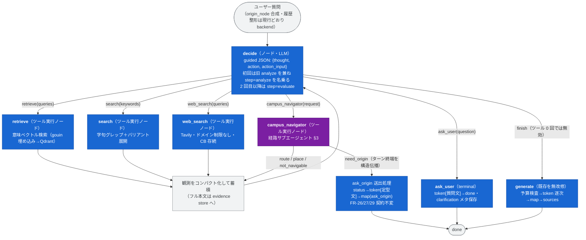

# FR-34: ReAct ハーネス刷新（ツール駆動探索＋経路サブエージェント）＋ Gemma 4 31B PP=2 復帰

- 版: **v1.0**（2026-07-18, Fable 確定 — P1〜P4 PoC **全ゲート合格**（§6-2 実測）を受けて §7 を確定。
  実装（Codex）に入ってよい。v0.1: 同日起草・議論合意の仕様化）
- 位置づけ: **ハーネス v6**。FR-33（LangGraph 定義＝実行、`docs/LANGGRAPH_MIGRATION.md`）を基底とし、
  ワークフローノード内の固定処理を **ReAct ループ＋ツール**へ刷新する。あわせて生成 LLM を
  Gemma 4 31B へ戻し、本機＋nubia の 2 筐体パイプライン並列（PP=2）で運用する。
- 関連文書: `AGENT_ARCHITECTURE.md`（実装完了時に v2.0 へ全面改稿）、`AGENT_HARNESS.md` v5
  （プロンプトは実装時に v6 章を追加）、`MAP_CARD.md`（FR-26/27 の UX 契約 — 本 FR で不変）、
  `ARCHITECTURE.md` §3（SSE 契約 — 本 FR で互換維持）。

## 0. 決定ログ（2026-07-18, 利用者との議論・合意事項）

| # | 論点 | 裁定 |
|---|---|---|
| 1 | ハーネスの ReAct 化 | **採用**（利用者発案）。Retrieve / Search / Web_Search をノード内固定処理からツールへ。LLM がツール選択・クエリ再構成・打ち切りを判断する |
| 2 | Web 周回ポリシー | **廃止**（利用者指示）。「第 1 ラウンド akita-pu.ac.jp 限定・最大 3 周」の固定ゲートを撤去。web_search は常にドメイン制限なし・ドメイン指定パラメータも設けない（公式に寄せたい時はモデルがクエリ文字列で表現）。Tavily サーキットブレーカー（FR-18-1）は運用保護として**存続** |
| 3 | bootstrap | **設けない**（利用者指示）。固定順序（retrieve→search）は廃止。不変条件は「**ツール実行 0 回のままの finish は無効**」の 1 つのみ |
| 4 | analyze / evaluate ノード | **decide ループへ解体**。検索計画は decide 初回ターンが、経路意図はサブエージェントが担う |
| 5 | 経路ドメイン | **経路案内サブエージェントへ切り出し**（利用者発案）。メインは `campus_navigator` ツールで呼び出す。サブは「構造化結果を返す専門家」であり第二の話者にしない（§3） |
| 6 | ask_origin | **サブエージェント内の terminal ツール**。発動はモデルが提案し決定的バリデータが裁く（§3-3）。FR-26/27 の UX 契約は不変 |
| 7 | 逆質問 | **`ask_user` ツールを新設**（利用者発案）。自由文でユーザーに聞き返してターンを終端（§2-2） |
| 8 | 停止条件 | **総アクション回数の上限は設けない**（利用者指示）。主予算はコンテキスト使用量（soft/hard 2 閾値＋「evidence が generate 実予算を充足したら打ち切り」）。安全弁として同一アクション反復ガードと recursion_limit（§2-4） |
| 9 | 生成モデル | **Gemma 4 31B へ復帰**（利用者指示。`google/gemma-4-31B-it-qat-w4a16-ct`）。本機 3090 Ti＋nubia 3090 の **PP=2** で 1 論理エンドポイント（利用者裁定 R2。§1） |
| 10 | decide の機構 | **guided JSON（vLLM 構造化出力）を主**、native tool calling は PoC で安定なら昇格。transport は差し替え可能な薄い抽象（§4） |

### 0-2. PoC 実測から追加した裁定（2026-07-18, Fable）

| # | 論点 | 裁定 |
|---|---|---|
| 11 | native tool calling | **昇格見送り・guided JSON 主で確定**。P2 実測が準拠 20/20（100%）・オーバーヘッド −10.9%（unguided より速い）で昇格の動機がない。gemma4 パーサ試行はサーバー再起動コストに見合わず未実施。並列ツール呼び出しの需要が出た時に再評価 |
| 12 | decide プロンプトの大学アイデンティティ固定 | **必須**。P3 で試行プロンプトが「APU-Navi」とだけ名乗った結果、モデルが APU を立命館アジア太平洋大学（別府）と解決し Web クエリを誤構成した。本番プロンプトは冒頭で「**秋田県立大学 本荘キャンパス**（由利本荘市）」を明示し、**略称「APU」は使用禁止** |
| 13 | 筐体間ファイアウォール | **相手ホスト単位の allow**（例: `ufw allow from <peer IP>`）。ポート列挙は不成立 — torch c10d は `DPマスターポート(0)+100`＝ポート 100 を選び得るし、NCCL/Gloo は動的高ポートを使う。ポートのピン留め（VLLM_PORT 等）はこの経路に効かない |
| 14 | GPU コンテナの NVML 剥がれ | **運用対処**。長時間稼働の GPU コンテナはホスト側 cgroup 再読込で GPU アクセスを失うことがある（`Failed to initialize NVML: Unknown Error`。2026-07-18 に head/worker 両方で実発生）。**serve 前に両ノードのコンテナ内 `nvidia-smi` を確認**し、失敗時はコンテナ再作成（重み・イメージは保持されるので数分で復旧） |
| 15 | generate の名乗り「APU-Navi」 | **ブランド名として維持**（2026-07-18 利用者裁定）。#12 の APU 禁止は decide / navigator（クエリ・判断系）に適用し、generate の自己紹介は直後に大学正式名の明示があるため誤解リスク低と判断 |

## 1. 前提インフラ: Gemma 4 31B・パイプライン並列 PP=2

### 1-1. 経緯と根拠

- 旧 31B 単カード構成（〜2026-07-12）は **`max-model-len 2816`・enforce-eager** だった
  （`ARCHITECTURE.md` v0.3 の撤去記録）。w4a16 でも 31B は重みで約 17GB を占め、24GB 単カードでは
  KV キャッシュがほぼ残らない。**2816 トークンでは ReAct（観測の蓄積＋証拠コンテキスト）は成立しない**。
- 対策 = **R2**: 本機 RTX 3090 Ti（24GB）＋ nubia RTX 3090（24GB・同一 LAN 別筐体）に
  vLLM multi-node（Ray）で層を分割配置（`--pipeline-parallel-size 2`）。重みが約半分ずつになり
  各カードに 10GB 級の KV が残るため、**16k コンテキストを狙える**。
- テンソル並列（TP）は層ごとの all-reduce が LAN 帯域で不成立のため**不採用**。PP は層境界の
  活性値転送のみ（デコード時 数 MB/s オーダー）で 1GbE でも成立する。

### 1-2. 構成要件

- 単一の OpenAI 互換エンドポイントとして backend から見えること（`VLLM_BASE_URL` 差し替えのみ）。
  Ray ヘッドは backend と同居する**本機を推奨**（API までのホップ最小化）。nubia はワーカー。
- nubia の IP は `.env` の `Inference_sever`（利用者記載済み）を参照する。
- 両筐体で vLLM / CUDA / モデル重み（HF キャッシュ）のバージョン・内容を一致させる。
  3090 Ti / 3090 は同一アーキテクチャ（GA102）の混成で、遅い側に律速される（許容）。
  層分割は**デフォルト等分で確定**（P1 実測: VRAM 23.2GB / 23.2GB と均等。
  `VLLM_PP_LAYER_PARTITION` は未使用のまま調整ノブとして残す）。
- 確定値（P1 実測合格）: `max-model-len 16384`（15,009 トークンの実プロンプト供給を確認）・
  `max-num-seqs 4`・prefix caching 有効（TTFT 98.8% 短縮を実測）。
- **公式 v0.25.0 イメージは ray を同梱しない**。両筐体で派生イメージ
  `pp2-vllm:v0.25.0-ray`（`infra/pp2/Dockerfile.ray`、ray 2.56.0）をビルドして使う。
- Gemma 4 の規約は 31B でも 12B と同じ: **thinking 非対応・`chat_template_kwargs` を送らない**
  （`AGENT_HARNESS.md` §4）。`client.py` の Qwen `enable_thinking` 分岐は遺物であり削除してよい。
- 埋め込み（Qwen3-Embedding-8B @ gouin）は現状維持。**3 筐体構成**（本機・gouin・nubia）になる。

### 1-3. 運用・可用性

- PP=2 は 1 論理インスタンスであり、**nubia 断・LAN 断・Ray 断で生成が全停止**する。
  死活確認・再起動・切り戻し手順は `infra/pp2/README.md`（利用者実施部分を明示済み）。
  worker は再join ループを持ち、head 再作成後は自動復帰する（2026-07-18 実証: head 再作成
  → 約 20 秒で 2 GPU 復帰）。serve 前チェックに §0-2 #14 の NVML 確認を含めること。
- **緊急切り戻し**: 12B 単機構成（現行 compose 定義）をプロファイルとして残す。ハーネス v6 の
  機構はモデル非依存（§4）なので、オープンキャンパス当日に PP 系が落ちた場合は 12B へ切り戻して
  品質劣化のみで継続できること（切り戻し手順も手順書に含める）。

## 2. 目標アーキテクチャ（メイン decide ループ）

### 2-1. decide ノード

- 入力: システムプロンプト（役割・ツールメニュー・方針）＋ 質問 ＋ 直近 4 ターン履歴（FR-18-5 踏襲）
  ＋ 行動ログ（これまでの action と要約結果）＋ コンパクト観測一覧 ＋ 予算状態（soft 超過時は
  「まとめに入れ」注記を注入）。
- **システムプロンプト必須要件**（§0-2 #12）: 冒頭で「秋田県立大学 本荘キャンパス（由利本荘市）の
  オープンキャンパス案内」であることを明示。略称「APU」禁止。この要件以外の骨格は P3 試行
  プロンプト（`infra/pp2/run_p3.py`、28/28 スキーマ準拠・ツール選択良好）を下敷きに Fable が
  実装時に確定版を書く（`AGENT_HARNESS.md` v6 章に全文記録）。
- 出力（guided JSON で強制）: `{"thought": "...", "action": "...", "action_input": {...}}`。
  `thought` は短い日本語 1〜2 文。SSE status の実況素材と `agent.trace` 記録に使う。
- **不変条件**: ツール実行 0 回での `finish` はエラー観測で差し戻す（「まず情報を集めること」）。
- 直前の assistant メッセージが clarification（ask_user 由来）の場合、**ask_user をメニューから外す**
  （連続逆質問の禁止）。
- ツール実行ノードの失敗はエラー観測として decide に返し degraded 続行
  （FR-33 の `_fault_tolerant_node` と同等の耐性。ターンを落とさない）。
- 同一 `(action, action_input)` の再発行は実行せず「同一の試行済みアクション」観測を返す（§2-4 安全弁）。

### 2-2. メインのツールメニュー（6 種 → **7 種**・2026-07-18 FR-38 で get_docs 追加）

| action | action_input | 動作 | 戻り（観測） | terminal |
|---|---|---|---|---|
| retrieve | `{queries: string[] (1..3)}` | 意味ベクトル検索。gouin 埋め込み → Qdrant 類似検索。ヒットは evidence store（`knowledge_results`）へマージ | 新規ヒットのタイトル＋断片、件数、重複除外数（FR-38: ヒット中心断片・file_id/chunk 位置/truncated 明示 — §2-5） | — |
| search | `{keywords: string[] (1..6)}` | 決定的字句グレップ（`app/rag/lexical.py` の正規化・バリアント展開）。部屋番号・固有名詞向け | 同上 | — |
| get_docs | `{file_ids: string[] (1..2)}` | **FR-38 新設（§2-5）**: file_id 単位の全チャンク取得（Qdrant・LLM 呼び出しなし）。chunk_index 順に evidence へマージ（兄弟展開の上位互換） | 本文先頭 ~1,500 tok（超過時 truncated 明示）＋「全 N チャンク取得済み（回答生成時に全文参照）」メタ | — |
| web_search | `{queries: string[] (1..3)}` | Tavily 検索＋本文取得。**ドメイン制限なし**。CB 開放時は「Web 検索は現在利用不可」観測 | 新規ヒットのタイトル・URL・抜粋。soft 閾値超過後は raw_content 取得を抑制 | — |
| campus_navigator | `{request: string}` | 経路サブエージェント呼び出し（§3）。履歴・解決済み事実はハーネスが機械的に添付 | `route`/`place`: 構造化結果の要約（steps_text 等）。`not_navigable`: 理由 | need_origin 時のみターン終端 |
| ask_user | `{question: string}` | ユーザーへの自由文の聞き返しでターン終端。status → token（question を分割送出・FR-25 の文字送り互換）→ done。sources 空。thread 保存時に clarification メタを付与（FR-27 の教訓: 履歴整形で崩さない） | —（terminal） | ✔ |
| finish | `{reason: string}` | 探索終了。generate へ遷移 | — | （generate へ） |

- ask_user のプロンプト方針: 「推測で答えられるなら推測を明示して答える方を優先。逆質問は回答が
  実質的に変わる場合のみ」（相手は高校生・保護者。逆質問の連発は UX 摩擦）。
  位置の確認だけは ask_user ではなく campus_navigator 経由の ask_origin（マップタップ UX）が担う。

### 2-3. SSE 外形（互換維持・フロント無改修）

イベント種別・スキーマ・順序契約（status→token→map→done / error）は `ARCHITECTURE.md` §3 から
**不変**。status の `step` 語彙 `{analyze, retrieve, search, web_search, evaluate, generate}` も
新値を追加せず再利用する（`text` は自由文でフロントはそのまま表示するため、実況の具体性は
`text` 側で出す）:

| 送出元 | step | text の例 |
|---|---|---|
| decide 初回 | analyze | 「質問を分析しています」 |
| decide 2 回目以降 | evaluate | thought 由来の短文（サニタイズし、不適なら定型文へフォールバック） |
| retrieve / search / web_search ツール | 同名 | 現行文言を踏襲しクエリ要旨を添える |
| campus_navigator（内部含む） | analyze | 「キャンパスマップで経路を調べています」等 |
| ask_user / ask_origin / generate | generate | 現行踏襲 |

系列は ReAct 化により可変になる（現行もループで可変であり、フロントは系列に依存していない）。

### 2-4. 予算・停止条件（決定ログ #8）

- **主予算 = コンテキスト使用量**（`/tokenize` 実カウント、失敗時 `estimate_tokens`）。
  - **soft 閾値**（暫定: 実効窓の 70%）: decide に「まとめに入れ」注記を注入し、
    web_search の raw_content 取得を抑制する。
  - **hard 閾値**（暫定: 実効窓の 85%）**または** evidence store が generate の実コンテキスト予算を
    すでに充足: アクションメニューを `finish`（と ask_user）のみに縮退 ＝ 事実上の強制終了。
    generate は現行の予算検査・縮小再構築をそのまま持つため、超過側の破綻はない。
- **安全弁**（チューニングノブではない・事故対策）:
  1. 同一 `(action, action_input)` 反復ガード（§2-1）。
  2. グラフの `recursion_limit`（FR-33 の 50 を踏襲）。
- **2026-07-18 FR-37 改訂（本番 recursion_limit 到達事故対応。背景: `SPEC.md` FR-37）**:
  1. 観測 1 件の上限を 120→**500 トークン**、チャンク抜粋を先頭 160→**400 字**（上位 3 件は不変）
     へ緩和。狙いは (a) 「抜粋が肝心の箇所の手前で切れる→途切れていると誤認して同義再検索」の
     空転根絶、(b) 観測が予算を実際に消費することで hard 停止が recursion_limit より先に効くこと
     （観測は行動ログ result と観測一覧に二重掲載 → 1 周最大 ~1,000 tok → 最悪 12〜14 周で hard）。
     `_web_observation` は共通上限（`OBSERVATION_TOKEN_LIMIT`）経由で同時に緩和される。
  2. 重複除外が発生した観測には「除外分の全文は evidence 取得済みで、回答生成時にそのまま
     参照される（再取得不要）」注記を付す（「見えない続き」を探し続ける誤認の遮断）。
  3. **GraphRecursionError フォールバック**: `astream` が `GraphRecursionError` を送出した場合、
     `stream()` が累積している `merged_state`（updates マージ済み＝例外時点の evidence を含む）を
     入力に、**generate ノード単独の縮退グラフ**を実行して通常の token→done 契約で回答する
     （writer 契約・status/SSE 語彙は本経路と同一）。`knowledge_results`・`web_results` がともに
     空の場合は定型回答を token 分割配信（ask_user と同じ 8 字分割）。定型文言（2026-07-18 検収時確定）:
     「申し訳ありません。お探しの情報を見つけられませんでした。言い方を変えて、もう一度お試し
     いただけますか？」（来場者向けトーン・次の行動を促す）。
     `agent.trace` に `fallback_generate`（reason=recursion_limit・evidence 件数）を記録。
     `recursion_limit=50` は不変。checkpointer 追加・周回カウンタ復活は不可。
     テスト容易性のため `recursion_limit` はインスタンス属性（既定 50）として注入可能にする。
- **廃止する定数・state**: `MAX_LOCAL_SEARCH_FOLLOWUPS` / `MAX_RETRIEVAL_FOLLOWUPS` /
  `MAX_WEB_SEARCH_ROUNDS` / `MIN_WEB_ROUNDS_BEFORE_GIVE_UP`、周回カウンタ類
  （`web_search_rounds` / `local_search_followups` / `retrieval_followups` 等）。
  新 state（案・命名は実装裁量）: `actions_log` / `observations` / `context_usage` /
  `turn_terminated`。evidence store は既存 `knowledge_results` / `web_results` を続用する。

### 2-5. FR-38 改訂: 断片観測の truncated 明示と get_docs 全文取得ツール（2026-07-18 利用者発案・承認）

背景: 必要情報の散らばり範囲はクエリで動的に変わる（例: 「〇〇さんの出展内容」は人名の前後に固まるが、
「〇〇研究室の学生メンバー全員」はヒットした 1 ファイル全体が必要）。固定断片では列挙系を原理的に
拾えず、decide からは「ファイル全体が evidence に入ったか」も見えない。**LLM 抽出の別呼び出しは
行わない** — 全文を読む LLM は次周の decide 自身（追加 LLM 呼び出しゼロ・~10ms の Qdrant 取得のみ）。

1. **断片観測（FR-37 の「先頭 400 字」を置換）**:
   - search: 最初のキーワードマッチ位置**中心 ±200 字**（計 ~400 字）。
   - retrieve: クエリ語がチャンク内に字句出現すればその位置中心 ±200 字、なければ従来どおり先頭 400 字。
   - 観測の各ヒットに **file_id・chunk 位置（可能なら i/N・実装裁量）・truncated: true/false** を明示する
     （file_id が観測に出ないと decide は get_docs を発行できない）。
   - 重複除外注記（FR-37 §2-4）には対象 file_id を含める。
   - decide システムプロンプトへ追記: 「truncated=true は断片の続きがあることを示す。続き・全体が
     必要なら get_docs(file_ids) で全文を取得できる」。
2. **get_docs ツール（メニュー 7 種目・§2-2 表）**:
   - `{file_ids: string[] (1..2)}` → 対象ファイルの全チャンクを chunk_index 順に取得し evidence
     （`knowledge_results`）へマージ。既存の兄弟チャンク展開（`same_file_expanded_*` state）と整合させ、
     get_docs 済みファイルの再展開は不要化。
   - 観測 = 本文先頭 **~1,500 トークン**（専用上限・超過時は truncated と「全文は evidence 済み」を明示）
     ＋ 決定的メタデータ「file X: 全 N チャンクを evidence に取得済み（回答生成時に全文参照）」。
     小ファイルは全文が decide に見え、その場で列挙を確信して finish できる。
   - **行動ログ result はメタデータのみ**（~1.5k 本文の二重掲載はしない。§2-4 予算消費は観測一覧側で発生）。
3. **ガード**: file_ids は**過去の観測に現れた file_id のみ有効**（未知 ID はエラー観測＋既知 ID 一覧）。
   メニューへの get_docs 提示は既知 file_id が 1 件以上あるときのみ。同一 file_ids の再発行は反復ガード
   対象。観測は予算計測に乗る（重い精読ほど予算が減り自然に finish へ向かう — §2-4 の哲学と整合）。
4. **SSE/status**: additive に get_docs 用 step を追加（実況文は「資料全体を読み込んでいます…」級）。
   FE の未知 step 耐性を実装時に確認し、不足なら FE 側マッピング追加＋Vitest。イベント種別は不変。
5. **trace**: `get_docs` イベント（file_ids・chunks_added・total_chunks・観測トークン数）。

## 3. 経路案内サブエージェント（campus_navigator）

### 3-1. 原則

- **構造化結果を返す専門家**であり、来場者向けの最終文章は書かない（第二の話者にしない）。
  最終文章は常にメインの generate が一本で書く — token→map→done の順序保証・sources 組立・
  予算検査を無改修で使い回すため。
- 経路計算は純関数のまま（`campus_map.py`: `resolve_location` / `find_shortest_route` /
  `generate_route_steps` / `route_map_payload` / `place_map_payload` / `ask_origin_map_payload`）。
  **LLM に空間推論をさせない**（FR-11/26 原則）。

### 3-2. 入出力契約

- 入力（ハーネスが機械的に合成 — メインモデルの言い換えに依存しない。FR-26 §7-4 退行防止）:
  `{request（decide の依頼文）, question（原質問）, 直近履歴, 解決済み事実（履歴由来出発地等）}`。
- **fast path（LLM 0 回）**: まず決定的解決を試みる — request/question から目的地・出発地候補を
  抽出し `resolve_location` で解決。成立すれば即、下記を返す。曖昧・失敗時のみ内部 decide
  （guided JSON・上限 2〜3 手・内部ツール: resolve_place / find_route / ask_origin）へ落とす。
- 戻り値（構造化・メインへの観測または制御シグナル）:

| type | 内容 | メイン側の扱い |
|---|---|---|
| `route` | `steps_text`（決定的テンプレ由来）・`map_payload`（route）・`sources` | 観測として decide へ。map_payload / sources は state へマージし generate が使う |
| `place` | 所在ファクト・`map_payload`（place）・`sources` | 同上 |
| `need_origin` | `map_payload`（ask_origin）・定型文・sources（FR-29 位置インデックス出典） | **ターン終端を構造伝播**（§3-3） |
| `not_navigable` | 理由（例: 経路対象外・解決不能） | 観測として decide へ（他ツールで続行） |

### 3-3. ask_origin（terminal・バリデータが裁く）

- モデル（メイン decide またはサブ内部 decide）は ask_origin を**提案**できるが、発動の最終判定は
  決定的バリデータが行う:
  1. destination が `resolve_location` で解決できない → 終端せず**エラー観測で差し戻し**
     （「目的地を特定できない。名称を変えて再解決するか not_navigable を検討せよ」）。
  2. 出発地が履歴・解決済み事実で既知（FR-26 §7-4） → 差し戻し（「出発地は既知: 〇〇。find_route を使え」）。
  3. 合格時のみ `need_origin` としてターン終端。
- 終端時の挙動は現行 ask_origin ノードと**完全一致**: status[現在地確認文言] → token[定型文] →
  map(ask_origin) → done、sources は位置インデックス出典（FR-29）、composer ロック・
  タップ後の `origin_node` 再送と内部再合成（FR-27-1/2）は不変。
- 実装形: `turn_terminated` フラグを state に立て、campus_navigator ノードの条件エッジで
  decide / generate を**迂回**して終端処理へ抜ける。モデルの従順さに依存しない構造保証とする。

### 3-4. サブエージェントの SSE・trace

- 内部ステップも同一 writer で status を送出（§2-3 の表のとおり step=analyze・text 自由文）。
- `agent.trace` にサブ内部の thought / action / fast path 成否を記録する。

## 4. decide の機構（transport 抽象）

- **主: guided JSON** — vLLM 構造化出力（xgrammar 系・`response_format`/guided_json）で
  action スキーマ準拠をデコーダ側で保証。モデル非依存（31B/12B 切り戻しでも同一機構）。
- **床: 寛容パース** — 既存 `_parse_json_object`。guided 側の障害時フォールバック。
- **native tool calling は昇格見送りで確定**（§0-2 #11）。P2 実測で guided JSON が準拠 100%・
  オーバーヘッド負（unguided より 10.9% 速い）のため。`serve-31b.sh` の
  `ENABLE_NATIVE_TOOL_CALLING=1`（gemma4 パーサ）は将来の再評価用に残す。
- `VLLMClient` に transport を差し替え可能な薄いメソッド（例: `decide(messages, schema)`）を追加し、
  ハーネス本体は transport に依存しない。

## 5. 廃止・解体一覧（実装時）

- ノード: analyze / retrieve / search / evaluate / web_search（固定フローとしては解体。
  実体ロジックはツール実行ノードへ移設）・ask_origin ノード（サブエージェント §3 へ）。
- ルーティング関数: `_route_after_analyze` / `_route_after_retrieve` / `_route_after_evaluate`。
- Web 周回ポリシー（第 1R ドメイン限定・周回上限・`include_domains`）。CB は存続。
- §2-4 の廃止定数・周回カウンタ state。
- `client.py` の Qwen `enable_thinking` 分岐（遺物）。
- `AGENT_HARNESS.md` の analyze / evaluate プロンプトは decide / navigator プロンプトへ再設計
  （実装時に v6 章として全文を記録。v5 章は経緯として保持）。

## 6. PoC ゲート（実装着手の前提。P1〜P4 すべて合格が条件）

前段: **FR-33 の本番反映が先**（利用者作業）。ハーネス大改修の重ね積みを避け、切り分け可能に保つ。

- **P1 インフラ（PP=2 疎通・実測）**: 本機＋nubia の Ray クラスタで 31B が起動し、
  実効 `max-model-len`（目標 ≥16384）・`max-num-seqs`・デコードスループット・prefill レイテンシを実測。
  層分割比の調整（`VLLM_PP_LAYER_PARTITION`）。片系断時の挙動確認と再起動・切り戻し手順書。
  成果物: 起動定義（compose / スクリプト）＋ nubia 側手順書（**利用者実施部分を明示**）。
- **P2 機構**: 31B で guided JSON が動く（スキーマ準拠率・1 呼び出しのオーバーヘッド実測）。
  native tool calling パーサの可否を短時間で見切る（不可なら guided JSON 主で確定）。
- **P3 decide 品質スモーク**: `EVAL_QUESTIONS.md` 抜粋 10 問＋経路 3 種（route / place / need_origin）
  ＋逆質問 1 ケースで、ツール選択・打ち切り・逆質問の妥当性を Fable が定性判定。
  過小探索（ツール 0 回 finish の試行率）と空回り（同一アクション反復率）を記録。
- **P4 レイテンシ**: decide 1 ターンの実測、prefix caching の効き（ターン間の prefill 短縮）、
  代表質問での全体レイテンシが 60 秒目標（FR-33 基準）に収まる見通し。
- P1〜P4 の実測をもって §7 の暫定値を確定し、本仕様を v1.0 に改訂してから実装（Codex）に入る。

### 6-2. PoC 実測結果（2026-07-18 実施, Fable 判定: **P1〜P4 全合格**）

計測成果物: `infra/pp2/results/`（gitignore・ローカル保持。p1/p2/p3 の json+md）。

- **P1 合格**: 31B PP=2 起動（ロード〜API 約 3 分）。15,009 トークンの実プロンプト供給 OK。
  c1 TTFT 2.01s（2k プロンプト）・c1 デコード 37.9 tok/s・c4 集計 67.8 tok/s（1.79 倍スケール）。
  prefix cache: 8k プロンプト再送で TTFT 5.89s → 0.07s（**98.8% 短縮**）。VRAM 両カード 23.2GB で
  均等・層分割調整不要。片系断・NVML 剥がれ・再起動は同日の実障害で 3 回リハーサル済み（§0-2 #13/#14）。
- **P2 合格**: guided JSON スキーマ準拠 **20/20（100%）** vs unguided 0/20。guided 平均 1.110s は
  unguided 1.245s より **10.9% 速い**（12B では +20.8% のオーバーヘッドだったが 31B では逆転 —
  制約により冗長生成が消えるため）。native tool calling は昇格見送り（§0-2 #11）。
- **P3 合格**: 14 問（EVAL 抜粋 10＋経路 3 種＋頑健性）で全 28 decide がスキーマ準拠・
  ツール 0 回 finish **0/14**・同一反復 **0/14**。第一手のツール選択は 13/14 が Fable 判断と一致
  （残 1 は駅→キャンパスに campus_navigator → not_navigable 観測から web_search へ自己回復、許容）。
  失敗観測後のリカバリが的確（例: 経路解決失敗 → search で部屋番号特定へ、字句 0 件 → retrieve へ）。
  発見: 大学アイデンティティ固定の必須化（§0-2 #12）。
- **P4 合格（見通し確定）**: decide 1 ターン実測 **1.2〜2.1s**（completion 43〜80 tok）。prefix cache
  が効くためループ内の再 prefill はほぼ無償（0.07s 級）。典型 3〜5 手＋generate で総計 20〜35 秒
  想定 — 60 秒目標に収まる。最終確認は実装後の実 LLM E2E（§8-3）で行う。

## 7. パラメータ（確定 — 2026-07-18 PoC 実測に基づく）

| 項目 | 確定値 | 根拠 |
|---|---|---|
| soft 閾値 | **11,468 トークン**（= 16,384 の 70%） | P1: 実効窓 16,384 実測。decide プロンプトは 340〜450 tok 級で余裕大 |
| hard 閾値 | **13,926 トークン**（= 同 85%）または evidence ⊇ generate 実予算 | 同上 |
| 観測 1 件の上限 | ~~120 トークン級（タイトル＋2 行要約）~~ → **2026-07-18 FR-37 改訂: 500 トークン（抜粋 400 字×3 件）** | P3 では良好としたが、本番で「抜粋切れ→同義再検索」空転により recursion_limit 到達事故。緩和で空転根絶＋予算停止の実効化（§2-4） |
| navigator 内部 decide | 上限 3 手 | P3: 2 手内で回復動作を確認、余裕 1 手 |
| decide 温度・max_tokens | 0.2 / 300 | P2/P3: 実測 completion 43〜80 tok、300 で十分 |
| recursion_limit | 50（FR-33 踏襲） | ~~安全弁のみ・実測で接近せず~~ → 2026-07-18 本番で到達事故（空転 26 周）。FR-37 で到達時は evidence による generate 縮退へフォールバック（§2-4）。値は不変 |

## 8. 受け入れ基準（実装検収）

1. `pytest` 全 green（テスト資産は decide ループ対応へ書き換え。evaluate / ルーティング系は
   置き換え、ツール実装・generate・campus_map・SSE 外形系は流用）。
2. SSE 検証: 代表 5 シナリオ（通常 RAG／web_search 発火／ask_origin→マップタップ再送／
   経路 map(route)／ask_user 逆質問→次ターン回答）で、イベント種別・step 語彙・順序契約
   （status→token→map→done）が既存フロントで表示できること。
   ※ FR-33 と異なり系列の完全一致ではなく**契約互換**（ReAct 化で系列は可変になるため）。
3. 実 LLM E2E: `EVAL_QUESTIONS.md` 抜粋＋FR-26/29 検収基準から最低 6 本合格。
4. 退行禁止項目の個別確認: composer ロック・`origin_node` 再送と現在地チップ・map 送出順序・
   FR-29 sources・clarification / elicitation の履歴サニタイズ・Tavily CB・degraded 続行。
5. `agent.trace` に decide の thought / action / 予算状態・navigator の fast path 成否が記録される。
6. Vitest 89 / build green（フロント無改修の確認）。

## 9. ブランチ・進め方

- 直列: **FR-33 本番反映（利用者）✔ → P1 nubia 構築（Codex 準備・利用者実施）✔ →
  P2〜P4 PoC ✔（2026-07-18, §6-2）→ §7 確定・v1.0 改訂（Fable）✔ →
  実装（Codex, `feature/fr-34-react-harness` → develop PR）← いまここ → 検収（Fable）**。
- ランタイムフラグでの新旧ハーネス二重化は**しない**（FR-33 の教訓: 定義＝実行の一本を保つ）。
  ブランチで置換し、検収合格で merge。緊急時の後退は git revert と 12B 切り戻し（§1-3）で担保。
- 不明点は実装を止めず `docs/QUESTIONS.md` に起票（Fable 裁定待ち）。

## 10. ドキュメント更新（実装完了時）

- `AGENT_ARCHITECTURE.md` v2.0 全面改稿（decide ループ＋サブエージェント図・ツール表）。
- `AGENT_HARNESS.md` v6 章（decide / navigator プロンプト全文・定数）。
- `ARCHITECTURE.md`: モデル行（31B PP=2・3 筐体構成図）・LangGraph 行・vLLM 起動定義。
- `SPEC.md` 版繰り上げ（FR-34 は v0.26 で追記済み）。
