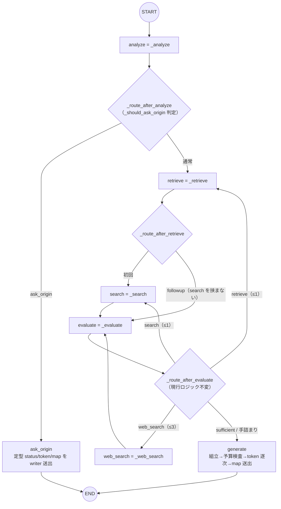

# FR-33: LangGraph 実行一本化（定義＝実行）

- 版: v0.2（2026-07-18, Fable — 実装・検収完了を反映。検収で判明した仕様側の誤り 2 件を
  出荷済み挙動へ訂正: §1 followup retrieve の条件エッジ・§2 ask_origin の sources。検収記録 §9）
  - v0.1（2026-07-17, Fable 起草 — 利用者要望「LangGraph で定義も実行もしたい」）
- 状態: **実装・検収完了（2026-07-18）**。実装: Codex/GPT-5.6Sol（reasoning xhigh）、
  検収・挙動保存修正: Fable。
- 背景: Q-006（2026-07-11）で `langgraph==0.0.69` が 2 回目 evaluate 後の分岐で停止したため、
  実行を `stream()` の手動逐次制御に移していた（経緯: `docs/AGENT_ARCHITECTURE.md` §2-0）。
  本 FR で当時の裁定を更新し、定義と実行を LangGraph に一本化する（Q-006 追補 2026-07-17）。

## 0. 実証済みの前提（Fable PoC, 2026-07-17）

`langgraph==1.2.9`（Python 3.11・async）で以下すべて動作確認済み。PoC:
scratchpad `langgraph_unify_poc.py`（本リポジトリ外・再現は §6 の受け入れで行う）。

| 当時実行を諦めた理由 | 1.2.9 での解決手段 | PoC 結果 |
|---|---|---|
| 2 回目 evaluate 後の分岐で停止（Q-006） | 循環＋conditional edge は現行系で安定 | evaluate ×6・web 3 周を完走 |
| status を「開始前」に出せない（FR-2） | ノード先頭で `get_stream_writer()` により custom イベント送出 | 全ノードで status が完了通知に先行 |
| token 逐次送出ができない（FR-3/25） | generate ノード内から writer で 1 token ずつ送出 | 13 token が 0.37 秒に分散到着（非バッチ） |
| 段階別フォールトトレランス | ノードを try/except デコレータで包み degraded 続行 | web 2 周目の例外を握って 3 周目へ継続 |
| ask_origin 短絡（FR-26） | analyze 後の conditional edge → ask_origin → END | 検索なしで token＋map(ask_origin) 送出 |

依存解決: 本番 venv への `pip install --dry-run langgraph==1.2.9` は衝突なし
（langchain-core 0.2.43→1.4.9 等が随伴。pydantic 2.13.4 / transformers 4.49.0 /
FlagEmbedding 1.3.5 のピンには触れない）。

## 1. 目標グラフ（定義＝実行。エイリアスノード廃止・動的周回へ統一）

現行 `stream()` の実行意味論をそのままグラフ化する。**外形（SSE）は 1 バイトも変えない。**

- ノードは 7 個: analyze / ask_origin / retrieve / search / evaluate / web_search / generate。
- **廃止**: retrieve_followup / evaluate_after_web / web_search_second / evaluate_after_second
  （エイリアスノード）、`_route_after_first_web_evaluate`、`_next_step_after`（現状も未使用）。
- Web ラウンドは現行実行と同じ動的制御（`_should_run_web_search`: 2 周無条件・
  3 周目は未解決キーワード残存時のみ・サーキットブレーカーで全スキップ）。
- `compile()` 後の実行は `astream(state, stream_mode=["updates","custom"],
  config={"recursion_limit": 50})`。多モード時の戻りは `(mode, payload)` タプル。

## 2. SSE アダプタ（`stream()` は薄い変換層になる）

- `stream()` のシグネチャ・イベント契約（`status`/`token`/`map`/`done`、
  `docs/ARCHITECTURE.md` §3）は**不変**。呼び出し側（FastAPI ルート・フロント）に変更なし。
- ノードは writer に **SSE 形のまま** `{"event": "...", "data": {...}}` を渡し、
  アダプタは custom payload をそのまま `yield (event, data)` する（変換ロジックを持たない）。
- アダプタは `updates` を辞書にマージ累積し、グラフ終了後に
  `DonePayload(thread_id, message_id, sources=merged_state["sources"])` で `done` を送出
  （ask_origin 経路の sources は `_assemble_generation_sources(state, None)` — FR-29 の
  位置インデックス出典を含む従来挙動。done 送出は従来どおり 1 回・終端のみ）。
- `updates` はトレース・done 用の内部利用のみで SSE には流さない。

## 3. ノード実装規約

- **status 先出し**: 各ノードの先頭で現行 `_status(step, state)` の dict を writer 送出。
  step enum・文言（`FOLLOWUP_STATUS_TEXTS` の followup 文言選択含む）は現行ロジックを流用。
- **generate ノード**: 現行の `_prepare_generation` → `_verify_generation_prompt` →
  `_stream_generation_with_retry`（縮小リトライ 1 回）を 1 ノード内で順に実行し、
  token を 1 つずつ writer 送出。末尾で `map_payload` があれば map を writer 送出
  （= token 完了後・done 直前という現行順序を構造的に保証）。
  リトライ時に差し替わる sources を戻り値の state 更新に必ず反映すること。
- **ask_origin ノード**: 現行短絡と同一系列（status[generate 文言] → token[定型文] →
  map[ask_origin]）を writer 送出。検索・生成は行わない。
- **例外耐性デコレータ**: retrieve / search / web_search に付与。現行 `stream()` の
  try/except と**同一の state パッチ**（retrieve: `retrieve_executed`/`retrieval_rounds`+1、
  search: `search_rounds`+1/`search_executed`、web_search: `web_search_rounds`+1）と
  同一の `logger.warning`（例外クラス名）を行い続行する。
- **state**: `AgentState` は TypedDict のまま（reducer 不要）。ノードは現行どおり
  部分 dict を返す（LangGraph の last-value チャンネル更新 ≒ 現行 `state.update()`）。
  ノード内でのみ局所的に state を書き換えている箇所（generate のリトライ等）は
  戻り値へ反映し、**ノード間の in-place 共有に依存しない**こと。
- `_trace` 呼び出し（agent.trace）は現行の位置・内容を維持。

## 4. 依存関係の変更

- `requirements.txt`: `langgraph==0.0.69` → `langgraph==1.2.9`（直接依存のみピンの現行方針を維持）。
- 随伴して langchain-core 1.4.9 / langgraph-checkpoint / langgraph-sdk / langsmith 等が入る。
  **LangSmith テレメトリが無効であること**（`LANGCHAIN_TRACING_V2` / `LANGSMITH_TRACING`
  未設定＝送信なし）を実装時に確認する。リポジトリに `.env.example` は存在しない
  （2026-07-17 確認）ため、運用注意は `ARCHITECTURE.md` に記載する（§7・Fable 担当）。
- checkpointer は使わない（1 リクエスト = 1 実行・永続化は SQLite の現行構成を維持）。

## 5. 削除・整理

- `stream()` 内の手動ループ一式（logic はノード側へ移動）。
- `_next_step_after`（死にコード）、エイリアスノードメソッド 3 種、
  `_route_after_first_web_evaluate`。
- `set_entry_point` は使わず `add_edge(START, "analyze")` 形へ（現行 API 推奨形）。

## 6. 受け入れ基準

1. `pytest` 134 全 green（`stream()` の外形が不変なので既存テストがそのまま効くはず。
   グラフ化で壊れるテストがあれば「外形が変わっていないか」をまず疑うこと）。
2. SSE 系列の完全一致検証: 代表 4 シナリオ（通常 RAG／web_search 発火／ask_origin →
   マップタップ再送／経路質問 map(route)）で、移行前後の SSE イベント種別・順序・step 文言が
   一致することをキャプチャ比較（token 本文と実行時間は LLM 非決定のため対象外）。
3. 実 LLM E2E: 既存検収基準（FR-26 §検収・FR-29 基準 20-23）から最低 4 本を再実行し合格。
4. `agent.trace` の互換（フィールド欠落なし）。全体レイテンシ 60 秒目標の非悪化。
5. Vitest 89 / build green（フロント無変更の確認）。

## 7. ドキュメント更新（実装完了時）

- `AGENT_ARCHITECTURE.md` §2 全面改稿（定義＝実行へ。§2-0 は経緯として残し、
  §2-2「定義の写し」と §2-3「乖離表」は廃止・§2-1 を唯一の図へ）。§3 の区分列を更新
  （ask_origin・generate 後段が「ノード」になる）。
- `AGENT_HARNESS.md` の「stream() 逐次制御が正（Q-006）」系の記述を本 FR 参照へ差し替え。
- `ARCHITECTURE.md` 技術表の LangGraph 行にバージョンと「定義＝実行」を明記。
- `SPEC.md` ロードマップに FR-33 追記・版繰り上げ。

## 8. ブランチ・進め方

- `feature/fr-33-langgraph-unify` → PR は `develop` 向け（リポジトリ規約どおり）。
- 不明点は実装を止めず `docs/QUESTIONS.md` に起票（Q-006 の追補も参照のこと）。

## 9. 検収記録（2026-07-18, Fable）

- 実装: Codex/GPT-5.6Sol（reasoning xhigh、session 019f7094-c6b8、232,890 tokens）。
  変更: `graph.py` / `requirements.txt` / `tests/test_agent_graph.py`。QUESTIONS 起票なし。
- **検収指摘 2 件 — いずれも仕様書側（v0.1）の誤りで、Sol は仕様に忠実だった。
  裁定「SSE 外形不変 ＞ 仕様書の字面」により出荷済み挙動へ戻し、仕様を訂正（Fable 直接修正）**:
  1. ask_origin done の sources を空にしていた → 旧実装どおり
     `_assemble_generation_sources(state, None)`（FR-29 位置インデックス出典）へ復元。
  2. 目標グラフの静的エッジ `retrieve → search` が followup retrieve にも search を強制
     （旧実装は followup → 直接 evaluate）→ `_route_after_retrieve` 条件エッジを追加し復元。
  教訓: 既存テストのアサーション変更は外形変更のシグナル。仕様起草時は「現行挙動の写し」を
  必ず実装・テストから直接取ること（古い文書の記述を信じない）。
- 受け入れ結果: pytest **139/139**（既存 134 は挙動保存アサーションのまま green・新規 5 =
  グラフ形状/例外縮退/循環系列/リトライ sources/系列強化）・Vitest 89・build green。
- 実 LLM E2E（検収用 :8081・実 vLLM/Qdrant/gouin・全 4 シナリオ合格）:
  1. 通常 RAG「食堂」: status 13 個（grep 追い・followup retrieve→直接 evaluate・Web 2 周の
     文言含む全アーム発火）→ token 176 → map(place) → done sources 11 件。
  2. ask_origin「D404に行きたい」: analyze → 現在地確認 status → 定型 token →
     map(ask_origin, 大学院棟) → done sources=[位置インデックス]。
  3. origin_node=cafeteria 再送: 全パイプライン → token 272 → map(route, カフェテリア→大学院棟,
     5 steps, 全 token 後・done 直前) → 回答冒頭で現在地明示（FR-26 §7-4）。
  4. レイテンシ実測: 標準質問 16.6 秒 / 569 token（60 秒目標内）。
- agent.trace 互換: 35 行・全イベント種別（analyze/expand/retrieve/search/evaluate/
  web_search/generate）出現・generate トレースのフィールド一致。
- LangSmith 系環境変数: 未設定のまま全件動作（テレメトリ送信なし）。
